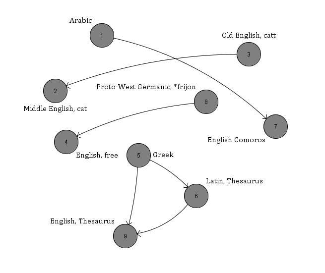
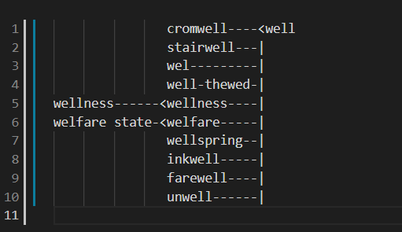
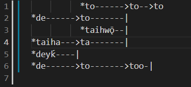
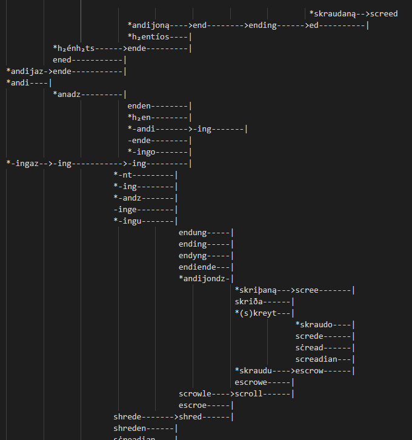

# Results

> ## Project Goals Description

### **Parsing**
The parsing folder does an excellent job in parsing the dataset, removing unnecessary columns from the dataset, and removing invalid relationship types in our edges. An inheritance guide was made to separate the valid and invalid relationship types to use in our dataset. After we run the parser on the full dataset once, the respective node and edges text files contain the data as described in the README.md. Then, we can load in our graph implementation based off of the edge and node text files, rather than re-parsing and re-processing the data for every run. 

### **Graph Implementation**
The key structures in our Graph Implemenation are the nodes, node ids, and the adjacency list. The adjacency list is the most important, where we stored a mapping of the AdjacencyNode pointers to a pair of edges connecting to the parents, and the edges connecting to the children. In our traversal, we have a directed graph that only can travel to the children of any designated node. However, we still desired to store the parents of the node so that our IDDFS and layered drawing could quickly and efficiently access the parents and iterate upwards, so we can see both the related words based off and based on a given term. Because we stored the adjacency list in an unordered map, we had to store some sort of order for the nodes, which is why we stored the Adjacency Node pointers in the nodes map, and a vector of the node ids, for user input access and conversion. One of the most important things about our graph implementation is how the graph is built off of the nodes and edges text files, instead of re-parsing and processing unnecessarily. It was vital to optimize our implementation and utilize helper methods to access the data and separate tasks for our algorithms. We created a plethora of adjacent access methods, such as parents, children, and all edges to make traversing the data simple.

### **Depth-First-Search Traversal**
Our Depth-First-Search traversal acts on the directed graph of our dataset. The key component for a successful traversal was storing the labels properly. As mentioned previously, we had to keep an order through a vector of our node ids so that one component would always switch to the next component in a regular, predictable, and testable manner. One unfortunate, but inevitable aspect of the traversal is that because we have a directed graph and treated it as directed during the walk, a term may move onto the next connected component before completing/traversing the whole current component. This is simply the expected behavior, but noticeable in the simply DFS traversal. We alter this behavior for the IDDFS, as it becomes more intuitive in the context of our dataset. However, the DFS still successfully traverses down directed edges, through every connected components, and past every node, as tested and outputted.

### **Iterative Deepening Depth-First-Search Traversal**
The Iterative Deepening Depth-First-Search Traversal behaves similarly to the DFS. One of the key differences is that it starts at depth 0, and takes in the max depth as a user parameter. We have sanity checks for behavior regarding 0 and negative depths, and equivalent start and end nodes. The traversal recursively checks at *d* distance away from the start node, and increments *d* for every iteration. The user's input, if too short in depth, can cause a term to not be found even though they are related in some ancestor or descendant relationship. If the depth input is excessively large, we added a check so that when the nodes start repeating from the previous recursive call, we know that the node is not in the current term relationship, and exits early. When a node is not found, a message to the console is displayed explaining this. Otherwise, if a node is found within *d* depth, then a message is displayed to the terminal listing that the term is found, and at what depth, which is less than or equal to *d*. The entire traversal is outputted to a text file, with lines printing the new depth iteration. The IDDFS returns true if the target node is related to the start node within the depth, and false otherwise. Our IDDFS is implemented so that a relationship can be found in both the parent and child relationship.

### **Layered Graph Drawing**
The Layered Graph Drawing takes in a term from the user, and prints either the direct children or direct parent relationships stemmed from that node. That means it outputs any and all parents of the term, the parent's parents (but not the other parent's children, i.e. the cousins of the term), or the children and their respective children. Read in a left-to-right manner, with the leftmost being the "top" of the tree, the furthest origins, and the rightmost being the "bottom," with the rightmost being the node itself. Terms are stored in layers on the y-axis, where all terms on a given axis are in the same generational relationship to the term. For example, the starting term is at axis = 0. The term's direct parents/children are at axis = -1, one layer to the left of the term. Those nodes' parents/children are at axis = -2, one more layer to the left from there, and two layers to the left of the original term. The method is void, but outputs to the layered-drawing text file. The function printDataset prints out parent layered graph drawings for each node in the dataset that does not have any children, which prints each node in the graph at least once, outputting into layered-drawing-dataset.txt.

> ## Outputs & Findings

### **Depth-First-Search Traversal Output**
As previously mentioned, the DFS traversal outputs to the dfs-traversal.txt in the algorithms folder. It runs efficiently and correctly on the entire dataset. We have a subset that provides a variety of edge cases within one dataset: multipel connected components, one way relationships, and multiple relationships. Here is an example of the subset dataset we used, nodes specifically selected from the dataset, and ran and tested on. This graph is created using GraTex. The Greek and Arabic characters could not be displayed on this application, but may be referenced in the test cases.

The node labels follow the order of the node ids stored in the graph. This means that when there are no directed children to follow, the DFS will follow numerical order. Following the algorithm for the DFS implies that Arabic term goes first, then its child Comoros. Since our component is complete, we moved to Cat, who has no chilren, so then moves to Catt. The rest of the DFS traverses as follows: free, Greek, Latin Thesaurus, English Thesaurus. The test cases corroborate this, and prove that DFS is successful, among other test cases and edge cases.

### **Iterative Deepening Depth-First-Search Traversal**
The Iterative Deepening DFS gives the user two extra pieces of information than the DFS does. First, it travels on the underlying (undirected version) of the graph, so that we can view all of a term's relationships instead of just the descendants. That way in the console, when running IDDFS, the user can input two terms and a given depth, and will receive two things: 1. A console message listing whether or not the target term was found at a given depth 2. The IDDFS traversal outputted to the deep-traversal text file. Within this text file, every time a new iteration of a new depth begins, a line will say "Starting depth *d*." We have success iterating in both directions. This way, if a parent node is distance 1 away from its child, the IDDFS will return true independent of the parent or child being the start versus the target. The other additional piece of information the user receives in the IDDFS is the depth of the relationship. Even for putting excessively large depths, the algorithms terminates when the term is found, and outputs this depth. It is fascinating to note how closely related two terms are. For direct descendants we expect to see a depth of 1, but terms that have evolved over centuries and over multiple languages and regions can be found at depths greater than 10. We have the following breakdown of when the IDDFS returns true or false, all checked in the test cases. Let *d* be the input parameter for depth, where start *s* and target *t* are the two input nodes. Let *D'* be the true depth relationship between the two nodes.

| True                   |         False   |
|----------------------|---------------------|
*s* == *t* for any *d* | *d* <= 0, and *s* != *t*
*s* is related to *t* at depth *D'* <= *d* | *s* is related to *t* at depth *D'* > *d*
&nbsp; | *s* is never related to *t*

### **Layered Graph Drawing**
The trickiest algorithm to implement was the layered graph drawing by far. Standard implementations involve the usage of libraries, which was restricted for the context of the assignment. We had to make alterations to how we planned to display our graph. We knew that using the cs225 displaying tactics of PNG and HSLAPixels was going to have awful runtimes and memory usage for larger graphs. Because of this, we decided to use standard text characters to output the graph. Additionally, instead of having a standard top-down layered graph (such as a family tree) we made our layered graph horizontal, as a left-right layered graph. This made it easier to implement and get the spacing correct for arbitrary components. The input for the layered graph drawing is a string of the unique id, taken in from the user as the language and the term. If the node is a valid node in the dataset, then the user can decide to draw the parents or the children of the layered graph. The given term is the right-most node in the graph, with the closest parents or children at the layer directly to the left of the term, and the parents/children of those nodes at the layer to the left of it. The method for layered graph drawing is void, but the results are directly outputted in the layered-drawing text file. We have many test cases for the outputs of parent and children layered graph drawing, as well as edge cases, including but not limited too inputs without parents or children.
Here is an example of running layered drawing on the term "English well" for the Children graph.

We can see that the original term "well" is the right-top-most node. All of its direct children are in the column to the left, such as cromwell, stairwell,wel,..., all the way to unwell. We can also see that welfare state is a child of welfare, which is a child of wellness. The english term wellness, the child of well, also has another child, Italian wellness. So, we can see that the descendants layered graph drawing correctly draws all of a node's respective children, and their children. 

Here is an example of running layered drawing on the term "English to" for the Parent graph.

We can see the original term "to" is the right-top-most node. All of its direct children are in the column to the left, such as to and too. Then, too has another child to, which has the child *de. The child to of to has the children *to, to, *taihwo, and ta, and so on. We see repetitions of some words because they are in different languages, meaning they aren't actually repetitions of the term itself. Overall, we can see that the layered graph is displayed intuitively to understand, and created in this axis layout formation so that each generation is in the same general column.

The layered graph drawings of all nodes in the graph, found in layered-drawing-dataset.txt, show us the origin of leaf nodes. This drawing visualizes an answer to our leading question: "How have the words we use evolved and changed over time?". We were impressed by the amount and size of the connected components in the layered graphs, as the dataset includes many terms that we didn't expect to have much relationship to each other. Here is an example of a larger component from the entire dataset layered drawing file.

